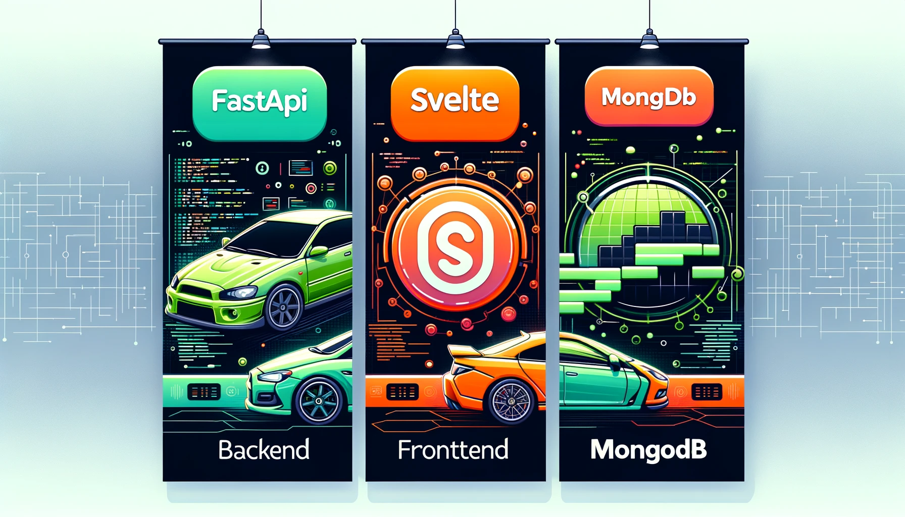

# Car Selling Store App



A Car Selling Store App Written in FastAPI, Svelte and MongoDB.

## Database

Setting your free Mongo Atlas account at https://cloud.mongodb.com/. Then, create an instance, a database, and a collection. After that, create a `.env` file at the root folder of the project and fill in the connection string (should be kept private), the database and collection name like below

```bash
DB_URL=""
DB_NAME=""
CARS_COLLECTION_NAME=""
```

## Backend

The backend is written in FastAPI and requires Python 3.12

```bash
conda create -n python3.12 python=3.12
conda activate python3.12
pip install -r backend/requirements.txt
```

To run the backend server, run the following in the terminal

```bash
uvicorn backend.app.main:app --reload
```

Assuming the backend server is run at `http://localhost:8000/`, we can test it with the installed `HTTPie` Python package like below

```bash
http "http://localhost:8000/"
```

## Frontend

The frontend is built using Svelte and SvelteKit

## References

- [Full Stack FastAPI, React, and MongoDB, published by Packt](https://github.com/PacktPublishing/Full-Stack-FastAPI-React-and-MongoDB/tree/main)
